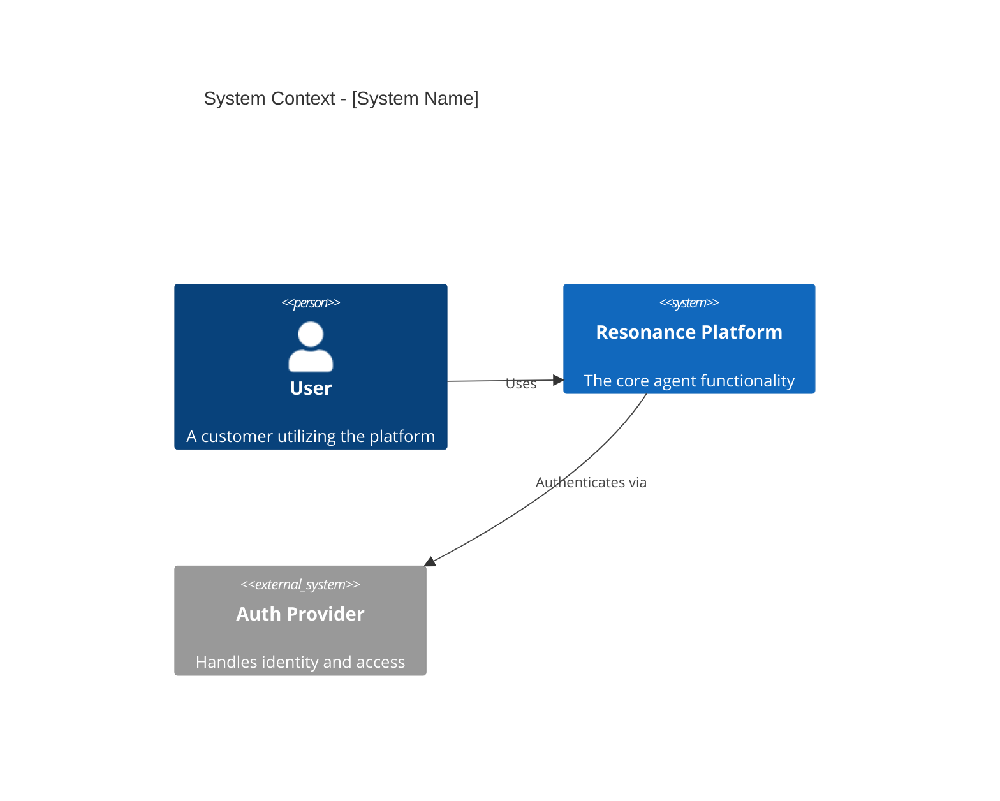
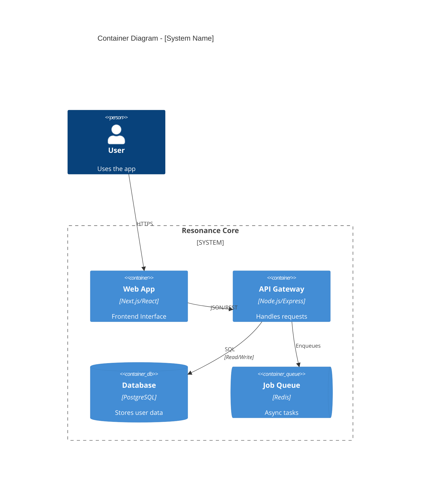
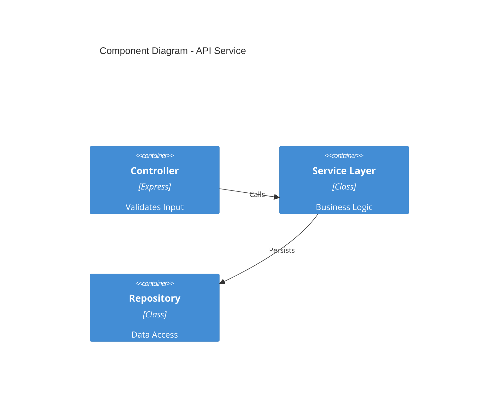

# Protocol: C4 Architecture Diagrams
> **Objective**: Standardize system visualization using the C4 Model (Context, Containers, Components, Code) and Mermaid syntax.
> **Philosophy**: "Context + Container diagrams are sufficient for 95% of documentation."

## 1. The Hierarchy (When to use what)

| Level | Diagram Type | Audience | Shows | Requirement |
|-------|-------------|----------|-------|-------------|
| **1** | **System Context** | Executives/All | System + Users + External Systems | **Mandatory** |
| **2** | **Container** | Architects/Devs | Apps, Databases, Microservices | **Mandatory** |
| **3** | **Component** | Developers | Internal Modules/Classes | *Optional* (Complex logic only) |
| **4** | **Code** | Developers | UML Classes | *Rare* (Use code instad) |

---

## 2. Templates (Copy-Paste)

### Level 1: System Context
*The Big Picture. No technical details (no "SQL", no "React"). Just "User", "System", "External System".*

### Level 2: Container Diagram
*The Technical Architecture. "What is running?" (Docker containers, Databases).*

### Level 3: Component Diagram
*The Module Structure. Only use for complex containers (e.g., a "Pricing Engine").*

---

## 3. Best Practices
1.  **Unidirectional Flow**: Arrows should generally flow Left -> Right or Top -> Bottom. Avoid cycles.
2.  **Action Verbs**: Label every relationship. `Rel(a, b, "Uses")` is weak. `Rel(a, b, "Publishes events to")` is strong.
3.  **Tech Labels**: In Container diagrams, ALWAYS specify technology (e.g., "PostgreSQL", "React", "gRPC").
