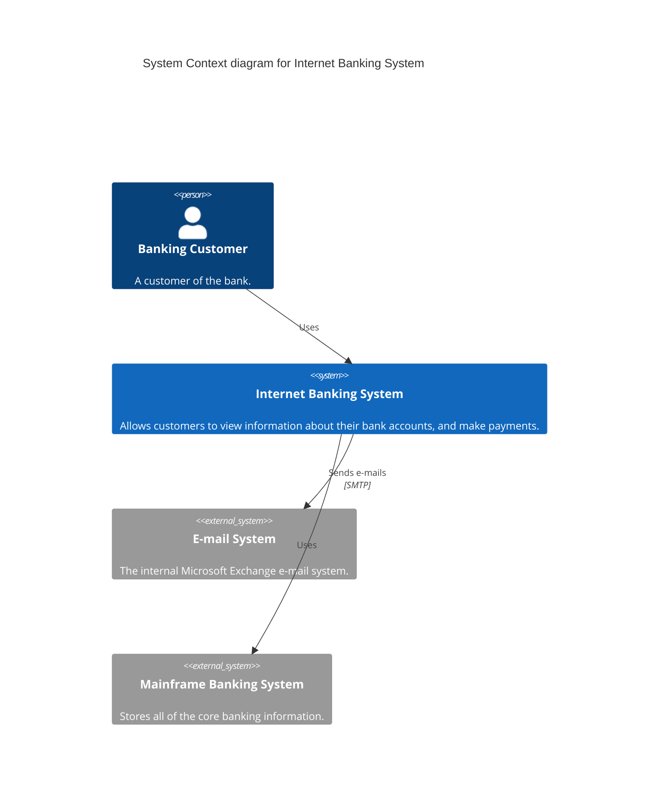

# C4 Model Protocol (Visualization Standard)

> "A common set of abstractions involves creating a static model of your software system at different levels of abstraction."
> — Simon Brown

## 1. The 4 Levels

1.  **Level 1: System Context Context**
    *   **Goal**: The Big Picture.
    *   **Audience**: Everyone (Non-technical).
    *   **Shows**: Users <-> System <-> External Systems (e.g., Stripe, SendGrid).
    *   **No internals**. Just boxes and lines.

2.  **Level 2: Container Diagram**
    *   **Goal**: The High-Level Tech Decisions.
    *   **Audience**: Developers & Architects.
    *   **Shows**: Web App, Mobile App, API Application, Database, File System.
    *   **Annotation**: Tech choices (e.g., [Docker], [Postgres], [React]).

3.  **Level 3: Component Diagram**
    *   **Goal**: The Internals of a Container.
    *   **Audience**: Developers.
    *   **Shows**: Controllers, Services, Repositories within the API Application.
    *   **Note**: Only draw this if the complexity warrants it.

4.  **Level 4: Code (Optional)**
    *   **Goal**: Implementation Details.
    *   **Audience**: Developers.
    *   **Shows**: Classes, Interfaces. (Usually generated by IDE).

## 2. The Notation Rules

1.  **Labels**: Every line MUST have a label describing the interaction.
    *   ❌ `User` ---- `System`
    *   ✅ `User` --[Visits Dashboard]--> `System`
2.  **Direction**: Flow of data or dependency.
3.  **Key**: Always include a legend for colors/shapes.

## 3. Mermaid JS Implementation

Use Mermaid `C4Context`, `C4Container`, `C4Component` diagrams.

